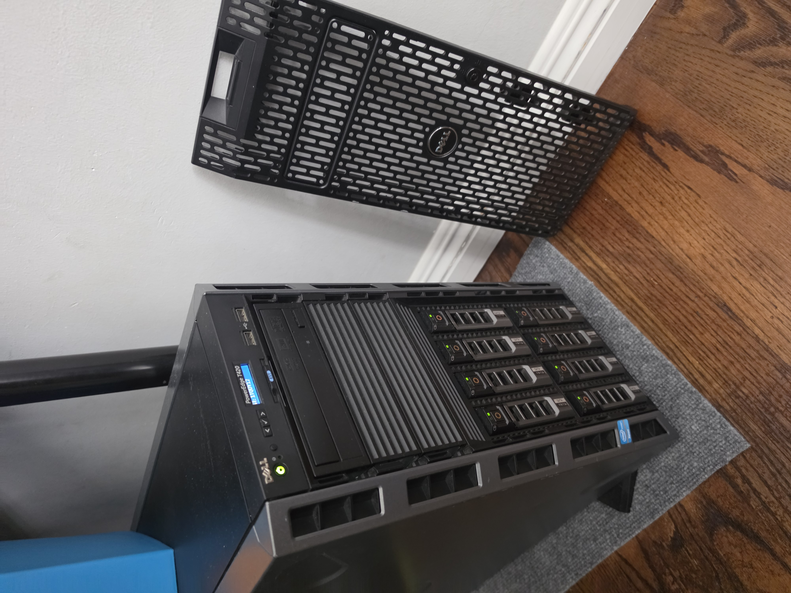
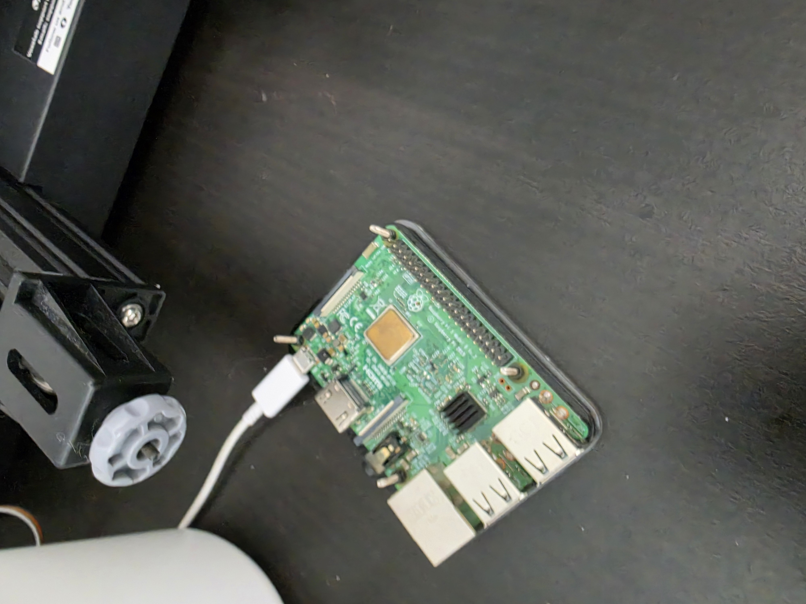
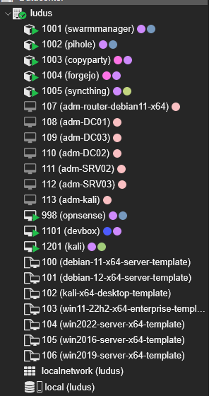

# State of the Homelab 2026
It was a little over a year ago that I obtained a server that used to be used in a business, a Dell PowerEdge T420.
Since then, what has been running on and in the server has changed quite a bit over the course of this year.
In this blog post, I want to document a bit of that evolution, and my plans for my homelab moving forward.

## Previous Experience
Before I got the T420, I played around a little with Proxmox on a laptop I wasn't using, mainly just trying out some random tutorials I found on YouTube about how to setup a basic fileshare or Minecraft server or such.
During this time, I also wanted to have a chance to access my Proxmox during my breaks while at school, which is when I discovered Tailscale.
Proxmox and Tailscale would go on to become the pillars of my home network.

## Proxmox Setup
I had gotten the T420 during summer break, and I would soon have to move to UCI.
Thus, I quickly setup RAID, Tailscale, and Proxmox on the server so I could access and play around with the server while I was at the dorms.
Additionally, because I at the time I wasn't sure if I wanted to always leave the T420 on, I setup Wake-on-Lan and was able to turn the server on through a Raspberry Pi 3 that I had always plugged in at home.
The services themselves would be run through Docker Compose deployed through containers on Proxmox.

It was at this time, when I started playing around with NixOS, through VMs hosted on Proxmox. I began making plans to migrate my configurations over from Docker Compose to NixOS, even researching how to run Proxmox through NixOS using something like [proxmox-nixos](https://github.com/SaumonNet/proxmox-nixos).

## NixOS Setup
Once I had the chance over a break, sometime in February of 2026, I began the migration, replacing the Proxmox host with NixOS.
The Nix ecosystem was quite complex to get into, but I was still able to figure out some tools to help manage the server. My main setup was to have the NixOS configurations stored in a flake that was hosted on the hypervisor itself, which then could be deployed to VMs individually through a simple command.
In fact, you can view the flake as I have archived the configuration on GitHub in my [nixlab](https://github.com/shellakajazzy/nixlab) repo.

However, as I kept using this setup as well as trying out various other configurations, I found it quite cumbersome to have to keep on editing and rebuilding a configuration file even for a simple and small change.
Compared to when I was just using Proxmox, it would take much longer to try out a new setting, and it would often not work out of the box due to the fact that the base system is NixOS and not Proxmox with all of the tools preinstalled.
I would have to hunt down specific packages when all I wanted to do was explore VLANs and network segmentation, something that just worked on Proxmox.
The declarative configurations were very nice when I wanted to just deploy my services from a single box using a single command and ensure it was reproducable, but it got in the way of experimentation.

## Ludus Setup
Finally, at the start of this summer, I migrated my server once again from NixOS to [Ludus](https://docs.ludus.cloud/).
I chose Ludus primarily because I can setup cyber ranges to practice pen testing against.
Additionally, I have struck a balance between declarative and imperative deployments using Docker Swarms, which allows me to run one command to deploy all of my services.
With a Docker Swarm setup, I was again able to declaraitevly reproduce my configurations across the swarm, even being able to deploy services to the Raspberry Pi 3, as well as giving me the flexibility to configure host-specific settings quite easily.
Rather than saving the configuration itself, I would just save the steps I took to configure the host on the [homelab](https://github.com/shellakajazzy/homelab) repo itself.

In adddition to the software update, I have installed a Radeon RX 480 with 8GB of VRAM for testing with AI.
Although it is probably not the best GPU, it is what I had on hand, and will probably be good enough for running small models.

Currently, I am running the following:
- OPNSense as a virtual router to manage the VLANs on Proxmox
- copyparty and Syncthing for syncing files and cloud storage
- Pi-hole as my DNS server
- Forgejo as my Git forge
- A dev box for a remote development environment
- A kali box for pentesting / cybersecurity related tasks
- A Game of Active Directory range that needs to be moved and retagged

I am using both the T420 and my Raspberry Pi 3, giving me backups for some services such as Syncthing and Pi-hole.

The thing holding networking everything together is still Tailscale, on which I use ACLs to segregate the hosts on the tailnet, as well as using functionality like [serve](https://tailscale.com/docs/features/tailscale-serve) and [funnel](https://tailscale.com/docs/features/tailscale-funnel) in order to have DNS names and certificates as well as exposing some of my services to the internet for my friends to use.

## Closing Thoughts
Overall, I feel like I have explored and will continue to explore many different possibilites for my homelab, but I do want to at least keep using Ludus and a Docker Swarm to keep growing it.
I want to gain the experience of actually maintaining a server that has services exposed to the internet, even if the service itself is not publicly available.
Right now, the homelab is simply something I have to host services I use for myself and for my friends.
Moreover, I want to keep practicing against cyber ranges on Ludus and work towards gaining the skills needed by a pentester.

Another thing I realized is that not everything needs to be self hosted on a server.
For example, offline and local services like KeePassXC and Markdown notes through apps like Logseq and Obsidian.

Finally, the last thing I learned was that I truly do not need to pay for more than the hardware that I already have, as I can use services like Tailscale to network and expose what I am hosting completely for free, at least on the scale that I need.

Next summer, hopefully I can do a State of the Homelab 2027 as it continues to evolve (and hopefully my blog writing gets a whole lot better too).